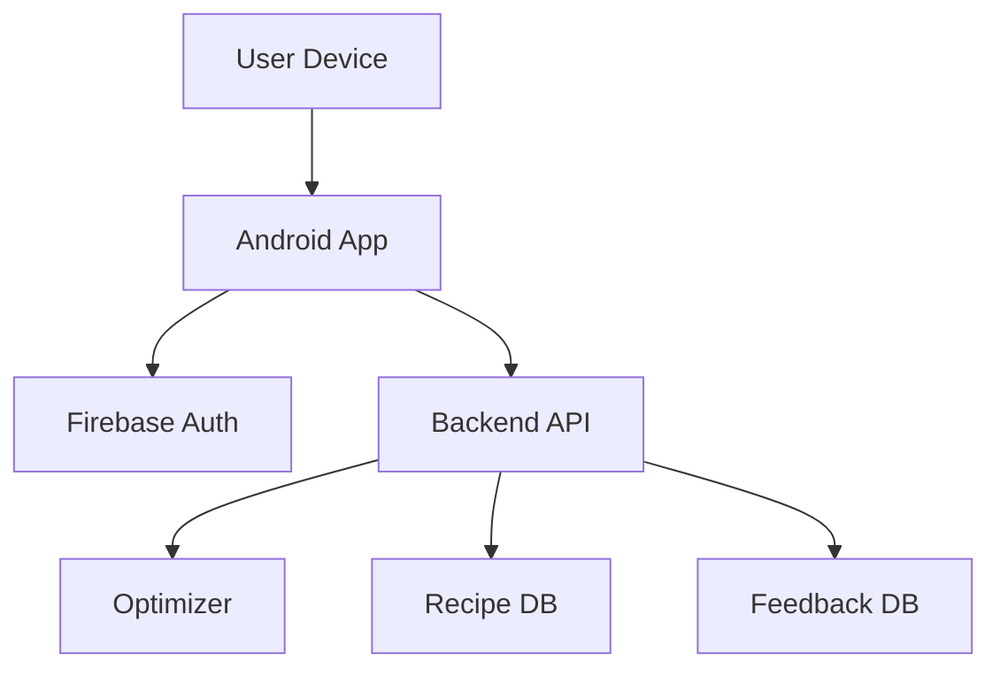

codex## Executive summary
PCOSINA is an Android app with a FastAPI backend that generates weekly meal plans using a two-stage MILP solver. The highest-risk areas are misconfiguration of authentication in production, exposure of API docs and admin endpoints, and availability risks from solver workload. The backend includes request size limits and schema version checks but uses permissive host settings and publicly enabled docs in code, which increase exposure if deployed as-is.

## Scope and assumptions
- In-scope paths: `app/`, `backend/`, `docs/`, `render.yaml`.
- Out of scope: CI/CD pipelines, build secrets outside repo, mobile OS security.
- Assumptions:
  - Backend is publicly reachable on Render.
  - Firebase auth is enabled in production.
  - Admin token is private and not logged or exposed.
  - Server-side data is limited to recipes and feedback messages.
- Open questions that could change risk ranking:
  - Is the backend restricted to internal/test use?
  - Are rate limits or WAF protections configured outside the app?
  - Is feedback content considered sensitive or regulated?

## System model
### Primary components
- Android app (Compose UI, DataStore, Firebase auth).
- FastAPI backend (plan generation, recipes, feedback).
- Optimization engine (OR-Tools CP-SAT in backend service).
- SQLite/Postgres database for recipes and feedback.
- Render deployment for backend.

### Data flows and trust boundaries
- User device -> Android app -> Firebase Auth
  - Data: email, credentials, tokens
  - Protocol: Firebase SDK
  - Security: Firebase auth, token issuance
- Android app -> Backend API
  - Data: profile, pantry, restrictions, plan requests, recipe IDs
  - Protocol: HTTPS (assumed)
  - Security: Bearer token auth, schema version check
  - Validation: Pydantic models and request size limit
- Backend -> Database
  - Data: recipe rows, feedback entries
  - Protocol: local DB or Postgres
  - Security: DB access from server process

#### Diagram

## Assets and security objectives
| Asset | Why it matters | Security objective (C/I/A) |
|---|---|---|
| Firebase tokens | Auth integrity | C/I |
| User profile data | Health-related info | C |
| Meal plan generation | Core service availability | A |
| Recipe database | Integrity of outputs | I |
| Feedback messages | Trust and privacy | C/I |

## Attacker model
### Capabilities
- Remote internet attacker can send requests to API endpoints.
- Can attempt token replay or send malformed payloads.
- Can flood the solver endpoint to cause DoS.

### Non-capabilities
- No direct DB access without server compromise.
- No mobile device compromise assumed.
- No internal network access assumed.

## Entry points and attack surfaces
| Surface | How reached | Trust boundary | Notes | Evidence (repo path / symbol) |
|---|---|---|---|---|
| `/generate-plan` | Internet | App -> Backend | Heavy compute, constraint abuse | `backend/main.py` generate_plan |
| `/recipe/{id}` | Internet | App -> Backend | Data retrieval | `backend/main.py` get_recipe |
| `/recipes/summary` | Internet | App -> Backend | Enumeration risk | `backend/main.py` recipe_summaries |
| `/feedback` | Internet | App -> Backend | Input storage | `backend/main.py` feedback |
| `/admin/feedback` | Internet | App -> Backend | Token gating | `backend/main.py` admin_feedback |
| `/docs` | Internet | App -> Backend | Info disclosure | `backend/main.py` docs_url |

## Top abuse paths
1. Attacker enumerates `/docs` to map API and target `/generate-plan` for DoS.
2. Attacker guesses or steals admin token from URL logs and reads `/admin/feedback`.
3. Misconfigured production with `FIREBASE_AUTH_DISABLED=true` allows unauthenticated access.
4. Large or frequent requests overwhelm solver time limits.
5. Host header abuse due to `allowed_hosts=["*"]` affects routing or logs.

## Threat model table
| Threat ID | Threat source | Prerequisites | Threat action | Impact | Impacted assets | Existing controls (evidence) | Gaps | Recommended mitigations | Detection ideas | Likelihood | Impact severity | Priority |
|---|---|---|---|---|---|---|---|---|---|---|---|---|
| TM-001 | Remote attacker | Public endpoint | Access `/docs` to map API | Info disclosure, easier attack | API surface | None if docs always enabled (`backend/main.py`) | Docs exposed in production | Disable/protect docs in prod | Log doc access | Medium | Medium | Medium |
| TM-002 | Remote attacker | Token exposure | Use admin token from URL | Feedback exposure | Feedback data | Token required (`backend/main.py`) | Token can be passed in query | Require header-only token; rotate | Monitor admin access | Medium | Medium | Medium |
| TM-003 | Misconfig | Auth disabled in prod | Call protected routes without token | Unauthorized access | Plan service | Firebase check (`backend/main.py`) | Auth bypass env exists | Enforce env validation; fail start if disabled in prod | Startup config checks | Low | High | High |
| TM-004 | Remote attacker | Public endpoint | Flood `/generate-plan` | DoS | Availability | Request size limit (`backend/main.py`) | No rate limit in app | Add rate limiting, queueing | Track solver latency | Medium | High | High |
| TM-005 | Remote attacker | Host header manipulation | Abuse permissive hosts | Routing/log abuse | Logs, app | TrustedHost middleware (`backend/main.py`) | `allowed_hosts=["*"]` | Restrict hosts | Log invalid host headers | Low | Medium | Low |

## Criticality calibration
- Critical: auth bypass in production, token theft with admin access.
- High: sustained DoS of solver endpoint.
- Medium: info disclosure via docs or feedback leaks.
- Low: host header abuse without proven exploit.

## Focus paths for security review
| Path | Why it matters | Related Threat IDs |
|---|---|---|
| `backend/main.py` | Auth, docs exposure, admin token | TM-001, TM-002, TM-003 |
| `backend/services/meal_planner.py` | Compute-heavy endpoint | TM-004 |
| `docs/backend-config.md` | Auth and solver config | TM-003 |
| `render.yaml` | Deployment runtime context | TM-004 |

## Notes on use
This threat model assumes a public backend with Firebase auth enabled in production and no external WAF or rate limiting. If those assumptions are wrong, re-rank TM-003 and TM-004 accordingly.
