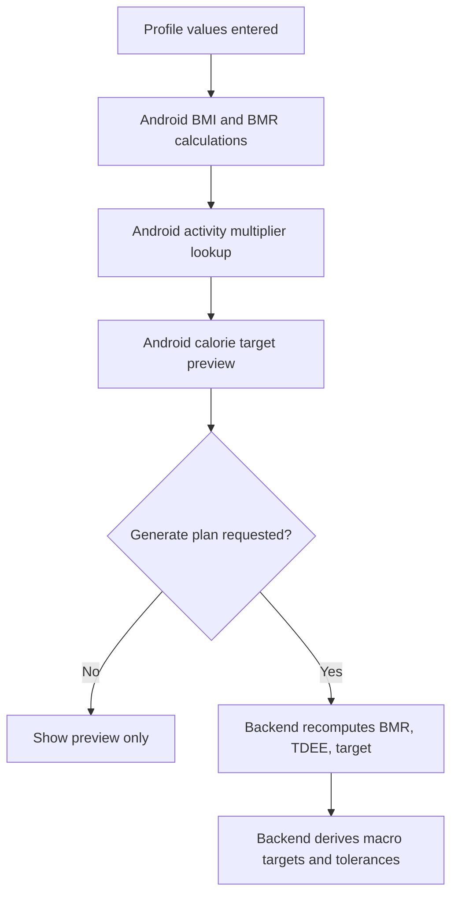
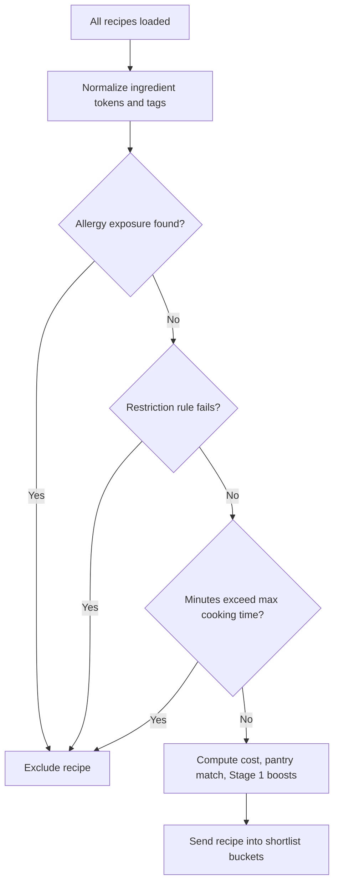
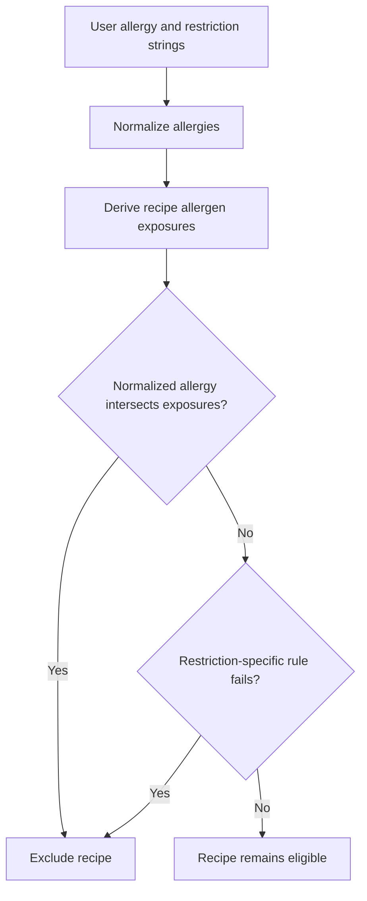
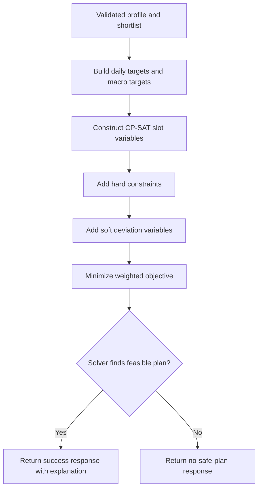
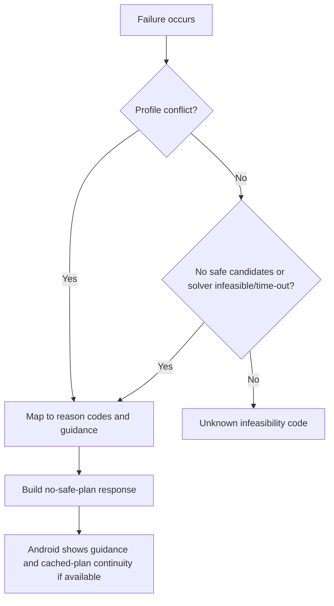
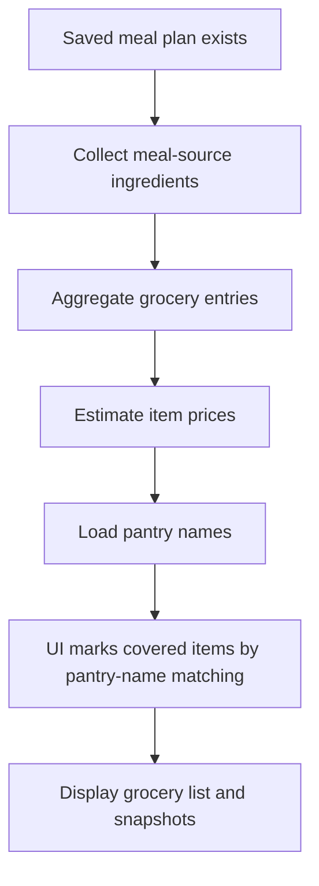
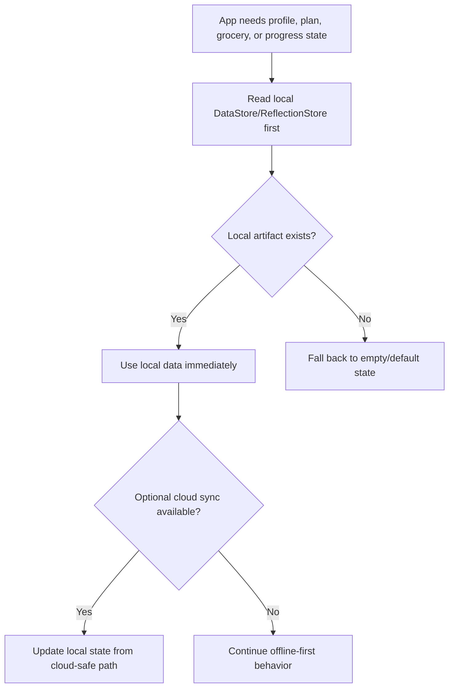
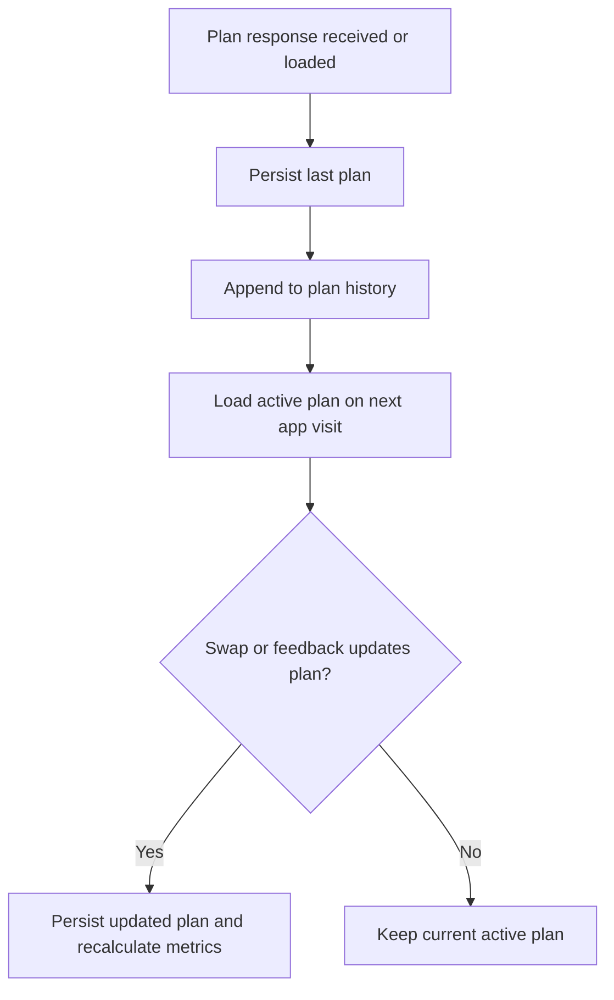
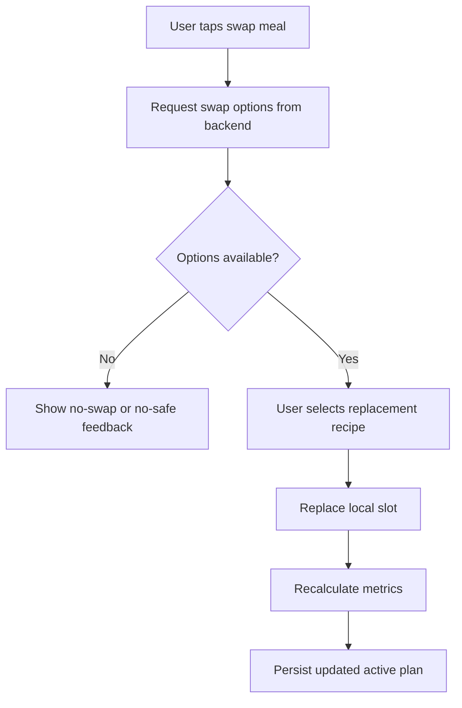
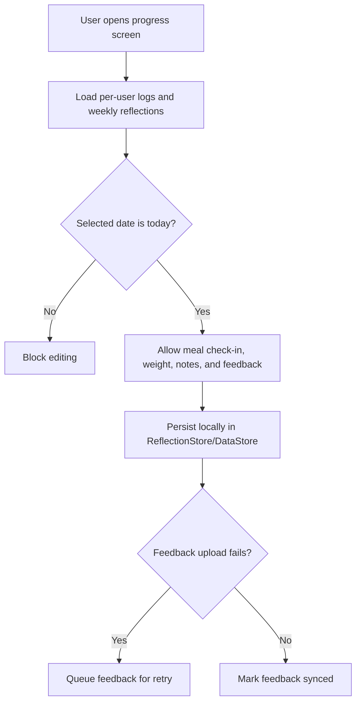

# Rule-Based Decision Trees

These are decision-flow diagrams based on actual code paths. They are **not** ML decision trees.

## A. Profile Validation Decision Tree

```mermaid
flowchart TD
    A[Generate plan request received] --> B{Android profile has age, height, weight, activity, goal?}
    B -- No --> C[Client rejects request before backend call]
    B -- Yes --> D[Backend validate_profile()]
    D --> E{householdSize 1..6 and maxCookingTime 10..240?}
    E -- No --> F[Return no-safe-plan or validation error]
    E -- Yes --> G{conflicting restrictions or priorities?}
    G -- Yes --> F
    G -- No --> H[Proceed to Stage 1 candidate shaping]
```

- Source files used: `app/src/main/java/com/pcosina/app/data/repository/MealPlanRepository.kt:34`, `backend/services/meal_planner.py:762`
- Input variables: age, heightCm, weightKg, activityLevel, goal, householdSize, maxCookingTimeMinutes, dietaryRestrictions, allergies, planningPriority, weeklyBudgetPhp
- Output variables: valid request or failure message
- Validation approach: manual invalid-profile cases plus backend unit tests for conflicting restrictions
- What to show during demo: incomplete profile handling and one conflicting-profile example

## B. Health Computation Decision Tree



- Source files used: `app/src/main/java/com/pcosina/app/domain/HealthMetrics.kt:29`, `app/src/main/java/com/pcosina/app/domain/HealthMetrics.kt:63`, `backend/services/meal_planner.py:800`, `backend/services/meal_planner.py:1474`
- Input variables: age, heightCm, weightKg, activityLevel, goal, insulinResistanceLevel, symptoms
- Output variables: BMI, BMI category, calorie target preview, backend macro targets
- Validation approach: manual step-by-step math with one shared sample profile
- What to show during demo: Android preview values and note backend authoritative recalculation

## C. Recipe Filtering Decision Tree



- Source files used: `backend/services/meal_planner.py:243`, `backend/services/meal_planner.py:729`, `backend/services/meal_planner.py:872`
- Input variables: recipe ingredients, tags, allergies, dietaryRestrictions, maxCookingTimeMinutes, householdSize, budget
- Output variables: kept/excluded recipe and shortlist diagnostics
- Validation approach: allergy/restriction test cases using actual recipes from `backend/recipes.json`
- What to show during demo: one excluded recipe and one kept recipe

## D. Allergy And Dietary Restriction Decision Tree



- Source files used: `backend/services/meal_planner.py:272`, `backend/services/meal_planner.py:307`, `backend/services/meal_planner.py:729`
- Input variables: allergies, dietaryRestrictions, recipe tokens, recipe tags
- Output variables: exclusion reason or pass-through
- Validation approach: fish/shellfish/dairy/egg/no-pork cases
- What to show during demo: fish allergy blocking `bangus`, shellfish allergy blocking `shrimp`

## E. Pantry Matching Decision Tree

```mermaid
flowchart TD
    A[Pantry items entered] --> B[Backend normalize_pantry()]
    B --> C[Normalize recipe ingredient tokens]
    C --> D[Count token overlap]
    D --> E[Add Stage 1 pantry score bonus]
    E --> F[Carry pantry reward/slack into Stage 2 objective]
```

- Source files used: `backend/services/meal_planner.py:262`, `backend/services/meal_planner.py:539`, `backend/services/meal_planner.py:1474`
- Input variables: pantryItems, recipe tokens, stage1 policy
- Output variables: pantryMatch count and score contribution
- Validation approach: manual token-overlap table using sample pantry and sample recipe
- What to show during demo: one recipe with high overlap and explain that pantry is rewarded, not hard-enforced

## F. Budget/Cost Decision Tree

```mermaid
flowchart TD
    A[Budget fields received] --> B[resolve_budget_weekly()]
    B --> C{Budget value exists?}
    C -- No --> D[No weekly hard cap]
    C -- Yes --> E[Estimate recipe costs]
    E --> F[Filter shortlist for budget-aware keep ratio]
    F --> G[Apply weekly budget hard cap in Stage 2]
    G --> H{Planning priority contains budget?}
    H -- Yes --> I[Add cost term to objective]
    H -- No --> J[Skip soft cost objective]
```

- Source files used: `backend/services/meal_planner.py:790`, `backend/services/meal_planner.py:529`, `backend/services/meal_planner.py:868`, `backend/services/meal_planner.py:1474`
- Input variables: weeklyBudgetPhp, budgetWeekly, budgetMonthly, householdSize, planningPriority
- Output variables: resolved weekly budget, cost-aware shortlist behavior, budget hard-cap enforcement
- Validation approach: compare budget and non-budget-priority runs/tests
- What to show during demo: budget priority versus balanced priority behavior

## G. Meal Plan Optimization Decision Tree



- Source files used: `backend/services/meal_planner.py:1474`, `backend/services/plan_response_builder.py:79`
- Input variables: shortlisted recipes, targets, policy, budget, pantry, restrictions
- Output variables: `GeneratePlanResponse`
- Validation approach: planner contract tests plus manual reading of constraints/objective
- What to show during demo: solver metadata fields and explanation payload

## H. No-Safe-Plan Decision Tree



- Source files used: `backend/services/plan_response_builder.py:9`, `backend/services/plan_response_builder.py:79`, `app/src/main/java/com/pcosina/app/ui/MealPlanViewModel.kt:997`
- Input variables: message text, diagnostics, profile, cached plan availability
- Output variables: structured no-safe-plan response and Android presentation state
- Validation approach: backend no-safe-plan contract tests plus UI tests
- What to show during demo: reason codes, guidance text, and cached-plan fallback

## I. Grocery List Generation Decision Tree



- Source files used: `app/src/main/java/com/pcosina/app/domain/GroceryAggregation.kt:64`, `app/src/main/java/com/pcosina/app/ui/screens/GroceryRefinedScreen.kt:1500`, `app/src/main/java/com/pcosina/app/data/repository/UserPreferencesRepository.kt:35`
- Input variables: recipe ingredient strings, household size, pantry entries, checked state
- Output variables: grocery items, prices, pantry-covered state, saved snapshots
- Validation approach: manual grocery rebuild check using one sample recipe
- What to show during demo: generated grocery items and pantry-covered behavior

## J. Offline/Local Cache Decision Tree



- Source files used: `app/src/main/java/com/pcosina/app/data/repository/UserPreferencesRepository.kt:35`, `app/src/main/java/com/pcosina/app/data/repository/ReflectionStore.kt:17`, `app/src/main/java/com/pcosina/app/ui/ProgressViewModel.kt:127`, `app/src/main/java/com/pcosina/app/ui/MealPlanViewModel.kt:68`
- Input variables: user ID, local artifact keys, cloud sync availability
- Output variables: loaded local state, optional sync update
- Validation approach: manual airplane-mode/load-from-cache demo
- What to show during demo: saved plan still appears without backend response

## K. Plan History And Active Plan Decision Tree



- Source files used: `app/src/main/java/com/pcosina/app/data/repository/UserPreferencesRepository.kt:35`, `app/src/main/java/com/pcosina/app/ui/MealPlanViewModel.kt:68`
- Input variables: plan response, plan history, active user ID
- Output variables: active plan, plan history, metrics
- Validation approach: save/load/swap walkthrough plus repository persistence tests where present
- What to show during demo: reopening the app and seeing the saved plan

## L. Swap Meal Decision Tree



- Source files used: `app/src/main/java/com/pcosina/app/data/repository/MealPlanRepository.kt:34`, `app/src/main/java/com/pcosina/app/ui/MealPlanViewModel.kt:68`, `backend/main.py:4506`
- Input variables: current recipe ID, mealLabel, activeRecipeIds, profile
- Output variables: swap option list or updated plan
- Validation approach: swap-path UI test plus backend candidate restrictions
- What to show during demo: swap one breakfast and observe metric update

## M. Progress Tracking Decision Tree



- Source files used: `app/src/main/java/com/pcosina/app/ui/ProgressViewModel.kt:127`, `app/src/main/java/com/pcosina/app/data/repository/ReflectionStore.kt:17`
- Input variables: selected date, meal check-ins, reflections, feedback payload
- Output variables: saved log state, queued feedback state
- Validation approach: same-day logging test and offline feedback retry check
- What to show during demo: today-only logging lock and local persistence after reopening the app
